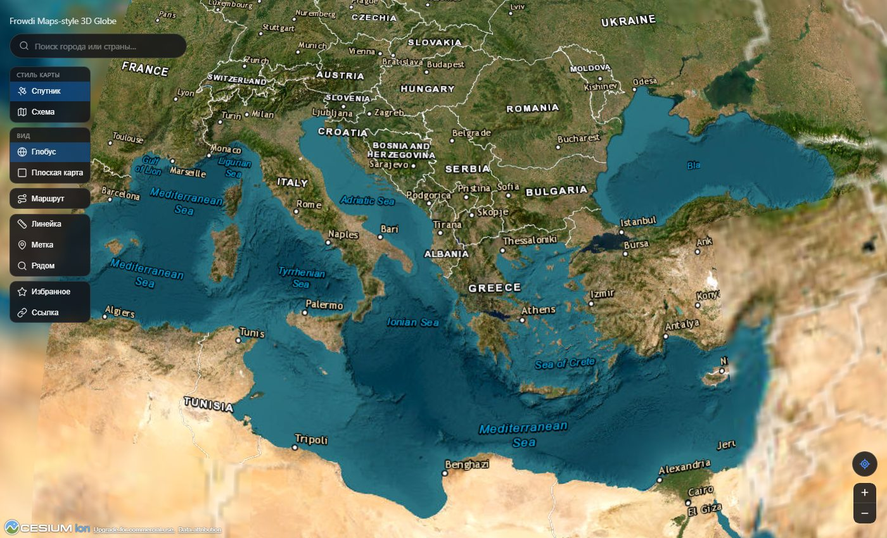
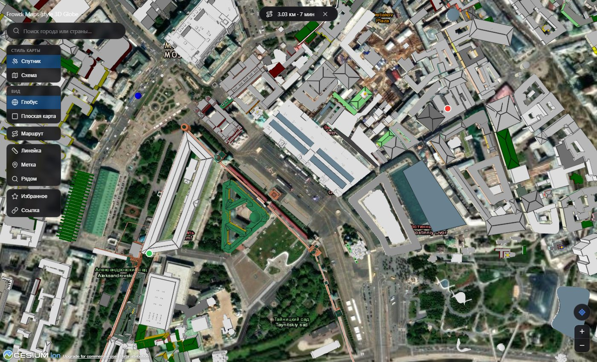
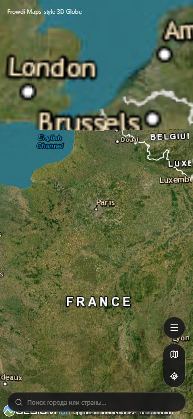

# 🌍 Frowdi Maps-style 3D Globe

**Интерактивный 3D-глобус в браузере в духе Google/Apple Maps** — от вида из космоса до
улиц города, с поиском, маршрутами, метками и живыми данными OpenStreetMap. Полностью на
клиенте: без бэкенда, без обязательных ключей, без сборки данных заранее.




## Возможности

### 🧭 Навигация
- **Поиск** — город, страна, адрес; живые подсказки по мере ввода, как в Apple/Google Maps
- **Маршрут** — клик по двум точкам → линия по реальным улицам, расстояние и время в пути
- **Моё местоположение** — определение и перелёт к реальным координатам устройства
- **Ссылка на вид** — координаты и масштаб камеры живут в URL, видом можно поделиться

### 🗺️ Слои и режимы
- **Спутник ⇄ Схема** — фотоснимки Esri или векторная карта OpenStreetMap
- **Глобус ⇄ Плоская карта** — 3D-сфера или классическая 2D-проекция, с ограничением
  панорамирования и зума пределами настоящей карты (не улетишь в пустоту за краем)
- **Гибридные подписи** — страны, границы, города и моря поверх спутникового снимка
- **Кликабельные 3D-здания** — тап по зданию показывает его теги из OpenStreetMap

### 🛠️ Инструменты
- **Линейка** — расстояние между двумя точками по эллипсоиду Земли (не по прямой через ядро)
- **Метки/избранное** — своя метка кликом по карте, сохраняется в localStorage
- **Поиск рядом** — кафе, аптеки, банки, остановки и т.д. вокруг точки (Overpass API)

### 📱 Адаптивность
- Отдельная раскладка для телефона: поиск — полноширинная плашка внизу экрана, компактное
  меню и быстрые кнопки — сверху над ней, в духе Apple Maps

<p align="center">
  
  
</p>

## Стек технологий

| Слой | Технология | Зачем |
|---|---|---|
| Рендер 3D-глобуса | [CesiumJS](https://cesium.com/platform/cesiumjs/) | тайловый LOD-глобус, эллипсоид WGS84, 3D-тайлы зданий |
| UI-фреймворк | [React 18](https://react.dev/) | компонентный интерфейс поверх WebGL-канваса Cesium |
| Сборка | [Vite](https://vitejs.dev/) + [vite-plugin-cesium](https://www.npmjs.com/package/vite-plugin-cesium) | быстрый dev-сервер и продакшн-сборка |
| Иконки | [lucide-react](https://lucide.dev/) | лёгкие SVG-иконки во всём интерфейсе |
| Геокодинг | Cesium ion (`IonGeocoderService`) | поиск с автодополнением |
| Маршруты | [OSRM](http://project-osrm.org/) | построение пути по дорожному графу |
| Ближайшие места | [Overpass API](https://overpass-api.de/) | запросы к данным OpenStreetMap |
| Состояние | React state + `localStorage` | без бэкенда и базы данных |

## Архитектура проекта

```
src/
├─ CesiumGlobe.jsx      # инициализация Cesium, вся логика режимов и обработчик кликов
├─ components/          # презентационные React-компоненты интерфейса
│  ├─ Toolbar.jsx           # основная панель инструментов (desktop + мобильный лист)
│  ├─ SearchBox.jsx         # поисковая строка с автодополнением
│  ├─ CompassZoom.jsx       # локация + зум (desktop)
│  ├─ MobileQuickActions.jsx  # компактное меню на телефоне
│  ├─ MobileMenu.jsx        # полное меню-шторка на телефоне
│  ├─ InfoPanel.jsx, BookmarksPanel.jsx, PinLabelForm.jsx, RouteSummary.jsx, ModeHint.jsx
└─ lib/                 # логика, не зависящая от React — обёртки над внешними API
   ├─ imagery.js            # слои карты (спутник/схема/подписи), с ретраями
   ├─ geocoder.js            # поиск мест
   ├─ osrm.js                # маршруты
   ├─ overpass.js            # поиск ближайших мест
   ├─ geolocation.js, geodesic.js, viewState.js, bookmarks.js, entities.js, format.js
```

## Быстрый старт

```bash
npm install
npm run dev      # http://localhost:1234
npm run build    # продакшн-сборка в dist/
```

### Свой токен Cesium ion (необязательно, но рекомендуется)

Без токена всё работает на общем демо-токене Cesium — он делится лимитом со всеми
пользователями Cesium в мире и может тормозить. Бесплатный личный токен снимает это
ограничение:

1. Зарегистрируйтесь на [ion.cesium.com](https://ion.cesium.com/tokens) и создайте токен.
2. Скопируйте `.env.example` в `.env` и вставьте токен:

   ```
   VITE_CESIUM_ION_TOKEN=ваш-токен
   ```

## На каких сервисах это работает

Проект намеренно использует только бесплатные, не требующие ключа публичные сервисы:
**Esri World Imagery** (спутник), **OpenStreetMap** (карта, здания, ближайшие места),
**OSRM** (маршруты) и **Cesium ion** (поиск, опционально — 3D-здания). Все они честно
помечены в коде как публичные демо-инстансы, не рассчитанные на продакшн-нагрузку — что
полностью соответствует масштабу учебного/личного проекта.

## Известные ограничения

- Подписи гибридного слоя (страны/города/моря поверх спутника) — только на английском:
  это бесплатный тайловый слой Esri с зашитыми в картинку подписями, языка не выбрать.
- Публичные OSRM/Overpass-инстансы делят лимиты со всем миром — при пиковой нагрузке
  возможны задержки.
- Избранное хранится в `localStorage` браузера — не синхронизируется между устройствами.
